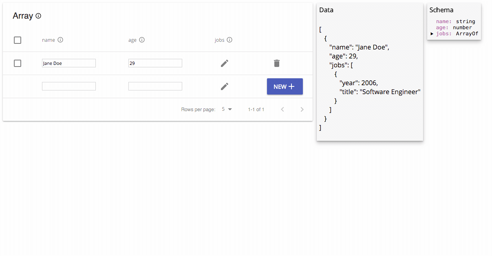

# `object-editor-react`

[](https://travis-ci.org/b-gran/object-editor-react) [](https://badge.fury.io/js/object-editor-react) [](https://github.com/b-gran/object-editor-react)

`object-editor-react` is a visual editor for structured JSON data, available as a simple drop-in React component.

* 🔌 Drop-in, structured editing of deeply nested JSON objects
* ⚛️ Schema aware: create nested objects and array elements in real time
* 🏗 Bulk operations for working with larger objects

## [Demo/example](https://b-gran.github.io/object-editor-react/githubExample.html) <sup><a href="https://github.com/b-gran/object-editor-react/blob/master/examples/github-example.js">(source)</a></sup>

## Preview



## How it works:

1. Create a `Schema` -- it can be as deeply nested as you need.
```javascript
import { SchemaTypes } from 'object-editor-react';

const schema = {
    foo: SchemaTypes.string({ required: true }),
    
    bar: {
        baz: SchemaTypes.arrayOf({
            nested: SchemaTypes.string(),
        }),
    },
}
```

2. Drop in an `ObjectEditor` or `ArrayEditor` and provide modification handlers.
```javascript
import { ArrayEditor, ObjectEditor } from 'object-editor-react';

const YourComponent = props => {
    return (
        <ArrayEditor
            type={schema}
            object={[{ foo: 'bar' }, { foo: 'baz' }]}
            onUpdateElement={(el, index) => ...}
            onAddElement={(newElement) => ...}
            onAddElement={(removedElement, index) => ...}
            />
    );
}
```

A table-based editor is generated based on the `Schema`. For properties
with types like string and number, you can just edit the values directly
using an `<input />` element.

For more complex properties (object, array, or other complex types), an
"Edit" button in the cell creates a nested Editor (type chosen
automatically) for editing the nested object.

## Installation

```
npm i object-editor-react
```

## Usage

To use `object-editor-react`, just create a schema and provide object modification handlers.
It's similar to using a controlled `<input />` element.

### Schemas

There are many different `SchemaTypes` that can be combined and nested however you need.
They are similar to `React` PropTypes.

A valid schema is either:

* An object whose leaves are `SchemaTypes`
* A `SchemaType`

Examples:
```javascript
import { SchemaTypes } from 'object-editor-react';

const schema = {
    foo: SchemaTypes.string({ required: true }),
    bar: {
        baz: SchemaTypes.any(),
    }
};
// Some valid instances:
// { foo: 'bar' }
// { foo: 'bar', bar: { baz: [] } }

const schema = SchemaTypes.arrayOf(SchemaTypes.string())();
// Some valid instances:
// [ 'one', 'two', 'three' ],
// [ ]

const schema = {
    foo: SchemaTypes.arrayOf({
        bar: SchemaTypes.array()
    })({ required: true }),
};
// Some valid instances:
// { foo: [ { bar: [] } ] }
// { foo: [] }
```

#### `SchemaTypes`

##### `any`

The value can be any non-`undefined` value.
The value must have a type other than `undefined`.

##### `string`

The value must have type `string`.

##### `boolean`

The value must have type `boolean`.

##### `function`

The value must have type `function`.

##### `number`

The value must have type `number`.

##### `date`

The value must be a `Date` instance with a non-`NaN` time.
Specifically, `Object.toString()` must return `"[object Date]"`, and `date.getTime()` must be non-`NaN`.

##### `array`

The value must be an `Array` instance.
Specifically, `Array.isArray()` must return `true`.

##### `object`

The value must have type `object`.

##### `arrayOf`

The value must be an `array` whose elements all conform to a specific `SchemaType`.

Specifically, the value must pass the `SchemaTypes.array` validation test, and each 
element of the array must pass the validation test of the `SchemaType` passed
as the argument to `arrayOf`.

##### `SchemaType` options

Each `SchemaType` is a function. Every `SchemaType` except for `arrayOf` 
takes a single, optional configuration object as its parameter. 

These are the possible configuration options.

| Key | Note | Required? | Default | 
| --- | ---  | ---       | ---     |
| `required` | is the key corresponding to this `SchemaType` required? | `false` | `false` |

In the case of `arrayOf`, the `arrayOf` function takes a schema as its
only parameters and returns a function that accepts a configuration object.

Example:
```
const schema = SchemaTypes.arrayOf({
    foo: SchemaTypes.string()
})({ required: false });
```

### Editors

There are two top-level Editor components: `ObjectEditor` and `ArrayEditor`.

Both Editor types are "controlled" components: any changes to the objects are passed to a change handler,
but the Editors themselves don't have internal state to track changes.

#### `ObjectEditor`

An Editor for editing a single `JSON` object.

```javascript
import { ObjectEditor } from 'object-editor-react';
```

`props`

| Prop | Type | Note | Required? | Default |
| ---  | ---  | ---  | ---       | ---     |
| `type` | `Schema` | The `Schema` to use when generating the Editor and validating objects. <br> Must be a valid `Schema` (an object whose keys are `SchemaType:s`, or a `SchemaType`) | `true` |
| `object` | `any` | the object to edit. must validate according to the `Schema` passed in the `type` prop. | `false` |
| `onUpdateElement` | `function` | `function onUpdateElement (updatedElement: Object ) -> void`. <br> Handler called when the object is updated | `true` |
| `className` | `string` | any additional class names for the editor table wrapper | `false` |
| `icon` | `function` | a function that returns an icon to use for each row in the table | `false` | no icon used |

#### `ArrayEditor`

An Editor for editing an array of objects, where each element in the array conforms to a `Schema`.

```
import { ArrayEditor } from 'object-editor-react';
```

`props`

| Prop | Type | Note | Required? | Default |
| ---  | ---  | ---  | ---       | ---     |
| `type` | `Schema` | The `Schema` to use when generating the Editor and validating objects. <br> Each element in the array must conform to this `Schema`. <br> Must be a valid `Schema` (an object whose keys are `SchemaType:s`, or a `SchemaType`) | `true` |
| `object` | `any` | The array to edit. <br> Each element must validate according to the `Schema` passed in the `type` prop. | `false` |
| `onUpdateElement` | `function` | `function onUpdateElement (updatedElement: Object, updatedIndex: Number) -> void` <br> Handler called when an element in the array is updated <br> The updated element and the index are passed | `true` |
| `onAddElement` | `function` | `function onAddElement (newElement: Object) -> boolean` <br> Handler called when a new element is added to the array <br> If this function returns true, the "add object" row is cleared  | `true` |
| `onRemoveElements` | `function` | `function onRemoveElements (removedIndices: [Number]) -> void` <br> Handler called when an element in the array is removed <br> The indices of removed elements are passed | `true` |
| `className` | `string` | any additional class names for the editor table wrapper | `false` |
| `icon` | `function` | a function that returns an icon to use for each row in the table | `false` | no icon used |

## Examples

See `examples/example.js` for a stateful implementation with a deeply nested `Schema`.